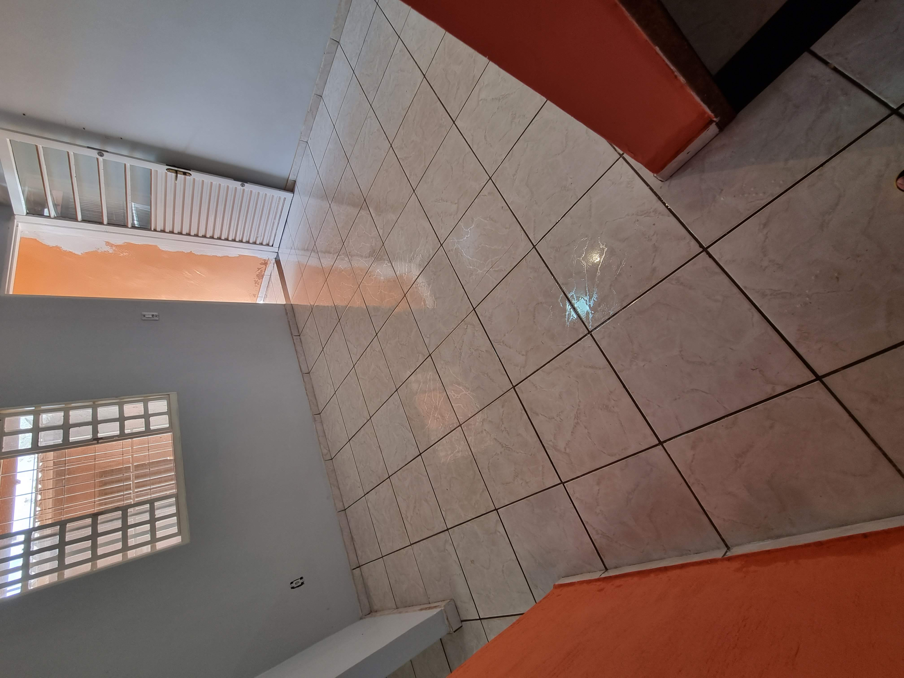
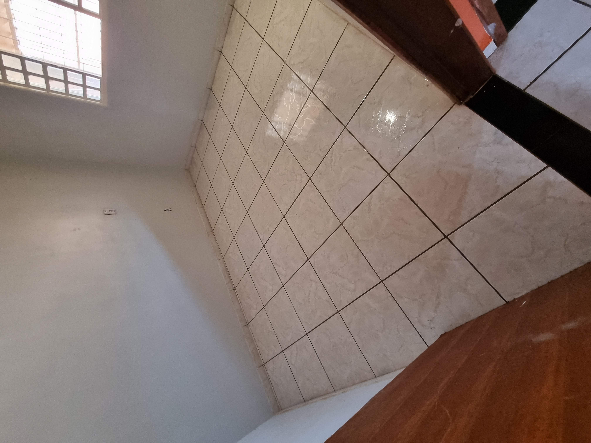

# Anúncio de Venda de imóvel

[Link OLX](https://df.olx.com.br/distrito-federal-e-regiao/imoveis/casa-no-residencial-ouro-verde-com-2-quartos-garagem-coberta-1195182449?)

Excelente casa no Residencial Ouro Verde/GO
Próximo a Brazlândia/DF

Características:

- 2 quartos
- sala
- cozinha
- banheiro
- área de serviço
- área de garagem coberta com capacidade para até 4 veículos

> 

> Próximo a parada de ônibus
> Próximo a futura escola e futura creche Estadual do Ouro Verde

## Valores

> **Ágio**: R$ 60.000,00
```
Faltam 159 prestações de 300 
Valor da prestação: R$ 380,00
Saldo devedor em junho de 2023: R$ 35.000,00
```
› Imóvel financiável, com habite-se e regulamentado pela caixa econômica.

> Valor quitado: R$ 95.000,00.

## Imagens

Faixada:


Varanda:


Sala




Cozinha


Quartos



Banheiro


Área da Frente


Área Lateral


Área dos Fundos coberta


Área descoberta


